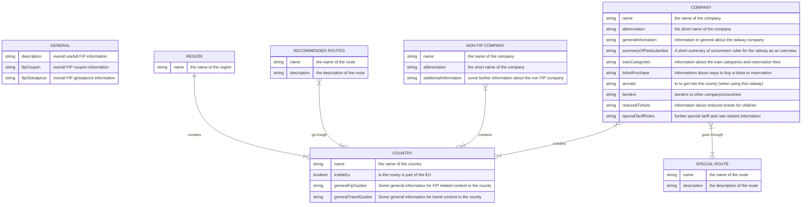

```mermaid
erDiagram
    GENERAL {
        string description "overall usefull FIP information"
        string fipCoupon "overall FIP coupon information"
        string fipGlobalprice "overall FIP globalprice information"
    }

    %% Region zur Zuordung im Menü und Übersichtsseiten
    REGION ||--|{ COUNTRY : contains
    REGION {
        string name "the name of the region"
    }

    COUNTRY {
        string name "the name of the country"
        boolean insideEu "is the coutry is part of the EU"
        string generalFipGuides "Some general information for FIP related content in the county"
        string generalTravelGuides "Some general information for travel content in the county"
    }

    "RECOMMENDED ROUTES" }|--|{ COUNTRY : "go trough"
    "RECOMMENDED ROUTES" {
        string name "the name of the route"
        string description "the description of the route"
    }

    "NON FIP COMPANY" }|--|{ COUNTRY : contains
    "NON FIP COMPANY" {
        string name "the name of the company"
        string abbreviation "the short name of the company"
        string additionalInformation "some further information about the non FIP company"

    }

    COMPANY }|--|{ COUNTRY : contains
    COMPANY {
        string name "the name of the company"
        string abbreviation "the short name of the company"
        string generalInformation "information in general about the railway company"
        string summaryOfParticularities "A short summary of uncommen rules for the railway as an overview"
        string trainCategories "information about the train categories and reservation fees"
        string ticketPurchase "informations about ways to buy a ticket or reservation"
        string arrivals "to to get into the county (when using this railway)"
        string borders "borders to other companys/countries"
        string reducedTickets "information about reduced tickets for children"
        string specialTariffRules "further special tariff and rate related information"
    }

    COMPANY }|--|{ "SPECIAL ROUTE" : "goes through"
    "SPECIAL ROUTE" {
        string name "the name of the route"
        string description "the description of the route"
    }


```
