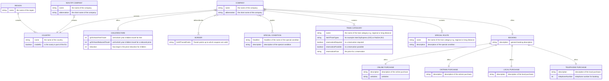

```mermaid
erDiagram
    REGION ||--|{ COUNTRY : contains
    REGION {
        string name "the name of the region"
    }

    COUNTRY {
        string name "the name of the country"
        boolean insideEu "is the coutry is part of the EU"
    }

    "NON FIP COMPANY" }|--|| COUNTRY : contains
    "NON FIP COMPANY" {
        string name "the name of the company"
        string abbreviation "the short name of the company"
    }

    COMPANY }|--|| COUNTRY : contains
    COMPANY {
        string name "the name of the company"
        string abbreviation "the short name of the company"
    }
    COMPANY ||--o| "CHILDREN FARE" : offers
    "CHILDREN FARE" {
        int upToYearsFreeTravel "until which year children travel for free"
        int upToYearsReducedTravel "until which year children travel for a reduced price"
        int reduction "how large is the price reduction for children"
    }
    COMPANY }|--|{ BORDER : definesBorder
    BORDER {
        string listOfTransitPoints "Transit points up to which coupons are valid"
    }
    COMPANY }|--|{ "SPECIAL CONDITION" : applies
    "SPECIAL CONDITION" {
        string headline "headline of the name of the special condition"
        string description "description of the special condition"
    }
    COMPANY ||--|{ "TRAIN CATEGORY" : contains
    "TRAIN CATEGORY" {
        string name "the name of the train category e.g. regional or long distance"
        string listOfTrainTypes "for example InterCityExpress (ICE) or RailJet (RJ)"
        boolean reservationRequired "is a reservation required"
        boolean reservationPossible "is a reservation possible"
        string reservationPrice "the price for a reservation"
    }
    COMPANY }|--|{ "SPECIAL ROUTE" : contains
    "SPECIAL ROUTE" {
        string name "the name of the train category e.g. regional or long distance"
        string description "description of the special condition"
    }
    COMPANY ||--|| BOOKING : offers
    BOOKING {
        string description "general booking description"
    }
    BOOKING ||--|| "ONLINE PURCHASE" : offers
    "ONLINE PURCHASE" {
        string description "description of the online purchase"
        string websites "websites"
    }
    BOOKING ||--|| "ONTRAIN PURCHASE" : offers
    "ONTRAIN PURCHASE" {
        string description "description of the ontrain purchase"
    }
    BOOKING ||--|| "LOCAL PURCHASE" : offers
    "LOCAL PURCHASE" {
        string description "description of the local purchase"
    }
    BOOKING ||--|| "TELEPHONE PURCHASE" : offers
    "TELEPHONE PURCHASE" {
        string description "description of the local purchase"
        int telephoneNumber "telephone number for booking"
    }

```
